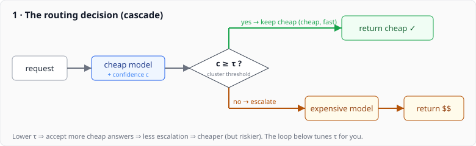
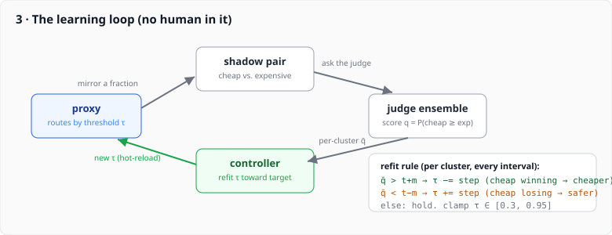
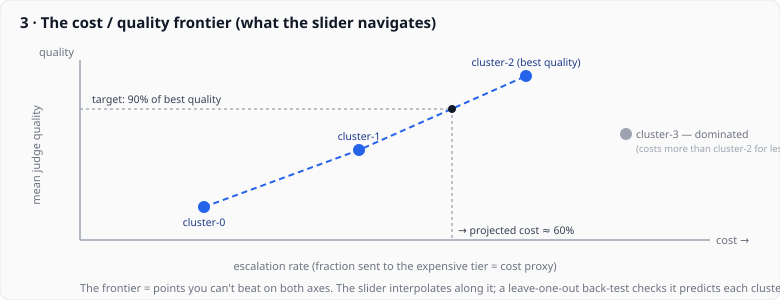
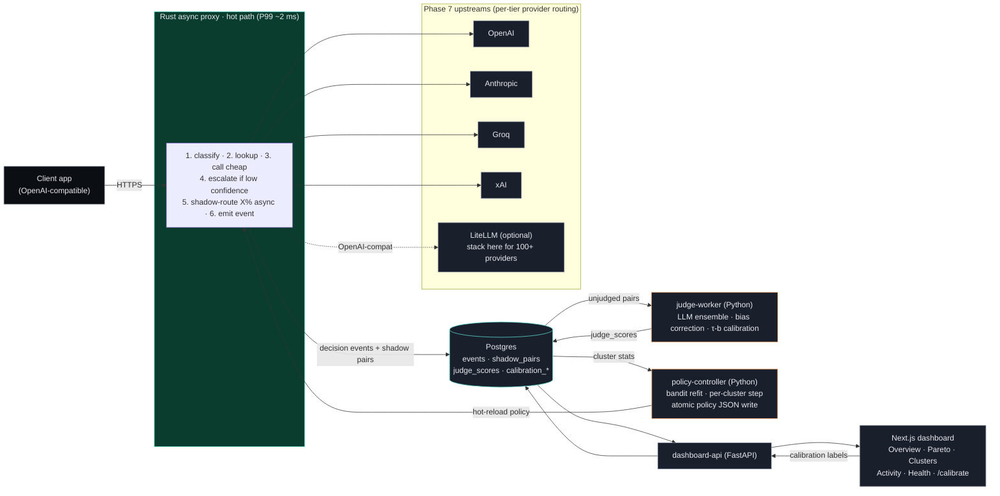

# Cascadia

[](https://github.com/cxk280/cascadia/actions/workflows/ci.yml)
[](LICENSE)
[](rust-toolchain.toml)
[](services/judge-worker/pyproject.toml)

**A self-hostable, OpenAI-compatible LLM gateway that learns the cheapest model which still clears your quality bar — per request — using counterfactual evaluation on your own live traffic. No golden dataset, no separate eval rig.**

## In a nutshell

Cascadia does **per-cluster cascade routing**: every prompt is sorted into one of N clusters, served by that cluster's *cheap* tier, and escalated to the *expensive* tier only when a cheap-tier confidence signal drops below the cluster's threshold. You pay for the strong model exactly on the requests that need it.

The hard part is **setting those thresholds.** Cascadia runs a **closed feedback loop on live traffic**: a configurable `shadow_rate` of cheap-tier responses is mirrored to the expensive tier in the background, an LLM **judge ensemble** scores the pair ("would the expensive model have been meaningfully better?"), and a controller **refits each cluster's threshold** from that signal — automatically, no human in the loop. Quality is human-anchored: the judge is calibrated against human labels via Kendall's τ-b — a −1-to-+1 score for how often the judge and a human rank the same two answers in the same order (1 = always agree, 0 = coin-flip). Target is ≥ 0.7; the synthetic set hits 0.83, and the real human gate is pending a *Prolific run* (Prolific is a platform for paying vetted people to do small tasks — here, labeling enough answer pairs for a statistically real result). Judging is pairwise with position-swap debiasing.

The output is a **cost/quality Pareto frontier** per cluster — the curve of best-possible tradeoffs, where every point is "already optimal": you can't get cheaper without losing quality, or better without paying more. Cascadia fits it from the system's own shadow data and renders it live at `/pareto` — that frontier, not a marketing number, is the headline artifact.

> **MLOps stack, end-to-end:** Rust hot path · Python judge + policy-controller · Postgres event log · Next.js operator dashboard · FastAPI read-side · Helm · Prometheus + OpenTelemetry.

## Try it: the keyless demo (one command)

No API key. No account. No sign-up. No cost. If you have **[Docker](https://docs.docker.com/get-docker/)** (running) and **[Node](https://nodejs.org/) 18+**, that's everything you need:

```bash
npx cascadia-gateway demo
```

That single command brings up the whole system in Docker and points it at a **built-in mock model** instead of a real provider — so it's completely free and works offline. It then sends a little sample traffic and prints a link. Open it:

**→ [http://localhost:3000](http://localhost:3000)** — log in with the demo account:

| email | password |
|---|---|
| `foo@bar.com` | `admin123` |

*(These are seeded only in the demo — hard-gated behind `CASCADIA_DEMO=true`, so this hardcoded login can never exist in a real deployment. A self-hosted instance uses normal email signup instead.)*

**What you're watching.** Cascadia is trying to answer one question continuously: *"what's the cheapest model that still clears the quality bar — per request?"* In the dashboard you'll see traffic sorted into **clusters**, each routed to a cheap model and escalated to an expensive one only when needed. In the background a **judge** scores "would the expensive model have been meaningfully better?", and a **controller refits each cluster's threshold** from that signal. Leave the dashboard open for ~30 seconds and watch the **per-cluster thresholds** and the **Pareto chart** (`/pareto`) shift on their own — that's the closed feedback loop learning, live, with nobody touching a config file. (In the demo the "models" are a stub, so the *numbers* are synthetic — but every moving part is the real thing.)

**That's the whole product in 30 seconds:** a self-tuning cost/quality loop you can watch work.

| | |
|---|---|
| First run is slow? | It compiles the services the first time (a few minutes); every run after is instant. |
| Something off? | `npx cascadia-gateway doctor` checks Docker, ports, and the rest. |
| Done? | `npx cascadia-gateway down` stops everything and wipes the demo's data. |
| Want real models? | `npx cascadia-gateway up` asks for your OpenAI + Anthropic keys and runs the same stack live (this spends real API budget). |

Prefer to read the launcher source or run from a clone? See [`cli/`](cli/README.md) and [Quick start](#quick-start) below.

> The demo's Pareto page is pre-populated with **representative per-cluster operating points** so the frontier and slider are live on first boot (a single mock model pair can't produce a real cost/quality *trade-off* — see the ELI5 below). The frontier math, projection, and back-test all run for real on those points.

## ELI5 — the math

Four moving parts. Each is simple on its own; together they're the closed loop you watch in the demo.

### 1 · Route cheap, escalate only when unsure



Every request hits the **cheap** model first. We read a confidence number `c` (0–1) off its answer (hedging words, length, etc.). Keep the cheap answer if `c ≥ τ` (the cluster's threshold); otherwise re-ask the **expensive** model. **Lower `τ` → more cheap answers kept → cheaper** (and slightly riskier). Picking `τ` by hand is the part everyone gets wrong — so we learn it.

### 2 · Score quality without a golden dataset

For a fraction of traffic (`shadow_rate`) we *also* ask the expensive model in the background, and a **judge** scores one question: how often is the cheap answer **at least as good** as the expensive one?

```
q  =  P(cheap ≥ expensive)   ∈ [0, 1]
```

LLM judges are biased toward whichever answer is shown first, so we ask **twice with the answers swapped** and average it out:

```
q  =  ( q(A,B)  +  (1 − q(B,A)) ) / 2
```

No labeled dataset, no separate eval rig — the signal falls out of serving traffic.

### 3 · Tune the threshold automatically



Per cluster, compare the mean judge score `q̄` to a target `t` (default 0.5):

```
q̄ > t + margin   (cheap is winning)  →  τ −= step   # route more cheap, save money
q̄ < t − margin   (cheap is losing)   →  τ += step   # escalate more, protect quality
otherwise        →  hold              ;  clamp τ ∈ [0.3, 0.95]
```

Run that every ~30s. Nobody edits a config file — the controller publishes a new policy and the proxy hot-reloads it.

### 4 · Read the cost / quality frontier



Plot each cluster as a point: **x = escalation rate** (your cost proxy), **y = mean judge quality**. The **efficient frontier** is the set of points nothing beats on *both* axes — the honest menu of "best you can do." The slider answers *"I want X% of best-tier quality — what will it cost?"* by interpolating along that curve, and a **leave-one-out back-test** reports how often the fitted curve predicts a held-out cluster's real cost within its 95% confidence interval.

**That's the whole system: route → measure → tune → visualize, on a loop.**

## What makes Cascadia different

Most gateways (LiteLLM, Portkey, OpenRouter) route on rules a human wrote and never tell you whether the rules are right. Cascadia *learns* the rules from a closed loop. They ask *"where does this request go?"*; Cascadia asks *"what's the cheapest model that still meets quality — and how do we know?"*

|  | LiteLLM / Portkey | Cascadia |
|---|---|---|
| Routing decisions | human-written rules | bandit refit from judge scores |
| Know the rules are right? | you don't | the Pareto chart, from shadow data |
| Quality measured? | cost-saved only | bias-corrected, human-calibrated judge ensemble |
| Adapts as models change | edit the YAML | refits automatically |

Three things competitors structurally don't do: **counterfactual shadow routing** (the "what would the expensive model have said?" signal falls out of serving traffic), **per-cluster online policy learning** (the [`policy-controller`](services/policy-controller/) refits because there's a closed loop to learn from), and a **bias-corrected, human-calibrated judge ensemble** (position-bias correction, anti-self-preference filtering, τ-b gating — academic-rigor evaluation, not a gateway feature).

**Provider breadth.** Cascadia natively speaks 4 providers (OpenAI / Anthropic / Groq / xAI). Any other OpenAI-shape host (Mistral, DeepSeek, Together, vLLM, your endpoint) is a one-env-var override — no code change. For everything else (Bedrock, Vertex, the LiteLLM 100+), **stack Cascadia on top of LiteLLM**: Cascadia decides the cascade, LiteLLM handles the N-provider plumbing. They're orthogonal and compose — Cascadia hands LiteLLM a resolved `(provider, model, request)`, LiteLLM handles auth/retries/quirks. (Cascadia has no retries or fallback chains by design — that's LiteLLM's lane.)

## Quick start

The fastest path is the keyless `npx cascadia-gateway demo` above — only Docker + Node, no keys, no cost. `npx cascadia-gateway up` runs the same stack against real providers (it prompts for your keys). Both wrap Docker Compose; the launcher lives in [`cli/`](cli/README.md).

**From source (contributors).** If you have the Rust + Python/uv + Node toolchain and want host-process iteration instead of containers:

```bash
./scripts/quickstart.sh
```

One command: brings up Postgres, writes a starter policy, builds and starts the mock upstream + proxy, drives synthetic traffic to fill the Pareto data, and launches the dashboard-api + dashboard. It prints each step (and the policy knobs) as it runs; Ctrl-C tears it down. Proxy → `localhost:8080` (OpenAI-compatible at `/v1`); dashboard → `localhost:3000` (first visit → `/signup`). **Every port falls back to the next free one if it's already taken** (so it won't fight another dev server) — watch the startup lines for the resolved ports. That includes Postgres: if a *foreign* Postgres already owns `5432` (a common one is a Homebrew/Postgres.app install), the cascadia container is published on the next free host port instead, and the connection string follows. The dashboard is **precompiled** (`next build` + `next start`) so navigation is instant; set `DASHBOARD_MODE=dev` for the hot-reloading dev server while editing the UI. Override the preferred values (`CASCADIA_PG_PORT`, `CASCADIA_LISTEN_PORT`, `DASHBOARD_PORT`, `CASCADIA_DASHBOARD_PORT`, `CASCADIA_MOCK_PORT`), plus `CASCADIA_DATABASE_URL` (use your own DB outright), `CASCADIA_POLICY_FILE`, `QUICKSTART_TRAFFIC`, or `CASCADIA_AUTH_DISABLED`, via the environment.

**Live data, standalone (real providers, real cost).** `CASCADIA_LIVE=1 ./scripts/quickstart.sh` runs the same stack against a real cascade instead of the mock — Anthropic `claude-haiku-4-5` → `claude-sonnet-4-6` by default — with real traffic, a real multi-model **judge panel** scoring shadow pairs live, and the controller refitting on a loop. Needs `ANTHROPIC_API_KEY` (cascade) and `OPENAI_API_KEY` (cross-family judge — the panel must be a different family than the cascade). Live mode **clears the synthetic seed first** so the dashboard shows only live data; add **`QUICKSTART_TRAFFIC=0`** to start from an empty dashboard and drive your own traffic (handy on camera — watch the KPIs and Pareto chart fill in real time). Signup is **double opt-in** — it emails a confirmation link you must click to finish (with no SMTP configured, the link is printed to `/tmp/cascadia-dashboard-api.log`); the first confirmed account becomes **admin**, and calibration is admin/reviewer-only (operators consume the calibrated judge, they don't label). The same mode becomes a LiteLLM-stacked demo later by pointing `CASCADIA_OPENAI_BASE_URL` at LiteLLM — no code change.

**Deploying instead?** Kubernetes → [`deploy/helm/cascadia/`](deploy/helm/cascadia/README.md). Container stacks → `deploy/compose/docker-compose.demo.yml` (keyless demo, what `npx cascadia-gateway demo` runs) and `docker-compose.full.yml` (real providers). Railway/Render/Fly → [PLAN.md §9 (2026-05-20)](PLAN.md).

## Accounts & email confirmation

The operator dashboard is gated by email + password auth. Signup is **double opt-in**: it creates an unverified account and emails a one-time confirmation link — the account can't sign in until that link is clicked. The **first** confirmed account becomes **admin** (per-instance — whoever signs up first against *this* deployment's database; nothing is hardcoded); everyone else is an **operator**, and an admin can promote others to **reviewer** (calibration-only) or admin. Calibration is admin/reviewer-only — operators consume the calibrated judge, they don't label.

Running a public/shared instance? Set **`CASCADIA_SIGNUP_DISABLED=true`** to seal signups once your admin exists — the bootstrap (first) account is still allowed, so you can't lock yourself out, but no one else can join. (Pair it with a bearer token on `/v1/*` and provider spend caps — see [SECURITY.md](SECURITY.md#self-hosted-vs-maintainer-hosted-demo-deployments).)

The confirmation email is sent over **SMTP** (works with Resend, SES, Postmark, Mailgun, Gmail, any SMTP host). **With no SMTP configured the link is logged instead of sent** (`grep "verification link" /tmp/cascadia-dashboard-api.log`) so local dev works offline. To send for real, set these on the dashboard-api:

```bash
export CASCADIA_SMTP_HOST=smtp.resend.com   # e.g. Resend
export CASCADIA_SMTP_PORT=465               # 465 = SSL; 587 = STARTTLS
export CASCADIA_SMTP_USER=resend            # provider-specific (Resend: literally "resend")
export CASCADIA_SMTP_PASS=re_...            # the provider API key / SMTP password
export CASCADIA_SMTP_FROM=onboarding@resend.dev   # a verified sender (Resend's sandbox delivers to your own address)
export CASCADIA_DASHBOARD_URL=https://your-dashboard   # base for the link (quickstart sets this to the local URL)

./scripts/test-email.sh you@example.com     # verify delivery before relying on it
```

Sessions are opaque server-side tokens in an httpOnly cookie (revocable, no JWT); see [SECURITY.md](SECURITY.md) and [PLAN.md §9](PLAN.md) for the threat model and rationale.

## Use it from the OpenAI SDK

Point any OpenAI client's `base_url` at the proxy (note the trailing `/v1`); streaming, tool-use, `response_format`, and multi-turn all keep working.

```python
from openai import OpenAI

client = OpenAI(base_url="http://localhost:8080/v1", api_key="...")  # api_key = bearer token if CASCADIA_PROXY_BEARER_TOKEN is set
resp = client.chat.completions.create(
    model="gpt-4o-mini",                       # ignored — the policy decides which model serves
    messages=[{"role": "user", "content": "hi"}],
)
```

Responses carry `x-cascadia-served-model`, `x-cascadia-served-provider`, and `x-cascadia-escalated` so you can reconcile billing without parsing the body. (Tool-use and streaming requests always report `escalated: false` — the cascade bypasses escalation on both by design, so those clusters show 0% escalation; not a bug.)

If `CASCADIA_PROXY_BEARER_TOKEN` is set, every `/v1/*` call needs `Authorization: Bearer <token>` (pass it as `api_key`). Unset = open, for local dev and private networks.

**Adding a provider:** if it speaks OpenAI's `/v1/chat/completions`, no code change — override `CASCADIA_OPENAI_BASE_URL` and prefix the model `openai/` in your policy. Full recipe (incl. Anthropic and air-gapped notes) in [`docs/adding-a-provider.md`](docs/adding-a-provider.md); customizing the judge/aggregator/refit in [`docs/extending.md`](docs/extending.md).

## Tuning for cost

Two policy-file knobs drive cost; the dashboard's `/clusters` page shows both per-cluster with the current live value.

| Knob | What it is | Direction |
|---|---|---|
| `threshold` (0–1) | Cheap-tier confidence floor; cheap is accepted when `confidence ≥ threshold`, else escalate. | **Lower → more cheap accepted → less escalation → cheaper.** |
| `shadow_rate` (0–1) | Fraction of accepted-cheap responses mirrored to the expensive tier for scoring. | **Higher → more expensive-tier calls → more cost.** 0.05–0.10 is the sweet spot; 0.0 disables the loop (and quality scoring). |

The proxy hot-reloads `CASCADIA_POLICY_FILE` on change; confirm a change landed by reading the live values on `/clusters`.

## Operations

| Endpoint (`:8080`) | Purpose |
|---|---|
| `POST /v1/chat/completions` | OpenAI-compatible chat — the hot path |
| `GET /livez` / `GET /readyz` | liveness / readiness (DB pool + ≥1 provider). `/health` aliases `/readyz`. |
| `GET /metrics` | Prometheus exposition |
| `GET /policy` | read-only snapshot of the live policy table |

Unimplemented paths (`/v1/completions` legacy, `/v1/embeddings`, image/modality endpoints) return a 404 in an OpenAI-shape error envelope with a remediation hint — Cascadia is a *cascade-routing* gateway, not an everything-proxy.

**Metrics** are Cascadia-specific (not LiteLLM/Portkey conventions): `cascadia_proxy_requests_total{route,provider,status}` (counter, bounded cardinality) and `cascadia_proxy_request_duration_seconds{route,provider}` (histogram). Per-cluster escalation/tool-use rates live on the dashboard, not in Prometheus.

**Resilience:** the proxy traps SIGINT/SIGTERM and drains in-flight requests (`CASCADIA_SHUTDOWN_TIMEOUT_SECS`, default 30s). Killing the controller leaves the proxy serving on the last-known policy file; killing the judge-worker doesn't touch the hot path; if Postgres is down the hot path stays responsive and event-log writes degrade to best-effort (`/readyz` reports 503).

## Architecture



```
cascadia/
├── crates/proxy/                  Rust async proxy — hot path
├── crates/mock-upstream/          instant-response mock for benches
├── services/judge-worker/         Python — LLM-as-judge ensemble + calibration
├── services/policy-controller/    Python — bandit-style threshold refit
├── services/dashboard-api/        Python (FastAPI) — read-side API
├── dashboard/                     Next.js 14 — operator UI (auth, Pareto, clusters…)
├── deploy/{compose,helm}/         local dev + Kubernetes
├── bench/                         reproducible benchmark scripts
└── docs/                          architecture, design specs, methodology
```

Full design history and the §9 decisions log: [PLAN.md](PLAN.md). Eval methodology: [docs/blog/methodology.md](docs/blog/methodology.md).

## Status

Phases 1–7 are shipped: the Rust proxy, 4-provider adapters with tool-use + streaming parity and a mixed-provider Pareto cluster, the judge ensemble, the bandit policy-controller (self-tunes from cold start), the dashboard, and the benchmark harness. ~70% expensive-tier reduction on a synthetic uncertain/confident mix; `bench/scripts/pareto-frontier.sh` reproduces the chart.

**Honest gap (Phase 5 calibration):** a 30-pair real-human pilot ran (Cohen's κ improved v1→v2 −0.02 → +0.52 after a rubric rewrite). The 3-judge panel reproduced **verbosity bias** (Zheng et al. 2023): panel-vs-human τ-b ≈ 0, lifted to ≈ +0.20 by a concision penalty. The original "τ-b ≥ 0.7" target was naive — humans and panels measure different dimensions of quality. A production-grade claim needs the ~200-pair Prolific run (~$300, deferred). Full diagnosis in the [methodology blog](docs/blog/methodology.md).

## Building the human-rated calibration set

The full toolchain ships in-repo — an active-learning sampler, the `/calibrate` labeling UI (position randomization + attention checks), an aggregator that emits canonical JSONL, and an LLM-panel backstop. The end-to-end runbook (sample → label → aggregate → compute τ-b) is in **[`docs/calibration.md`](docs/calibration.md)**.

## License

MIT — see [LICENSE](LICENSE). Productizes ideas from FrugalGPT (Chen et al. 2023), RouteLLM (Ong et al. 2024), AutoMix (Madaan et al. 2023), and LLM-as-a-Judge (Zheng et al. 2023). The closed feedback loop — counterfactual shadow eval driving routing policy without a hand-maintained golden set — is what Cascadia adds.
